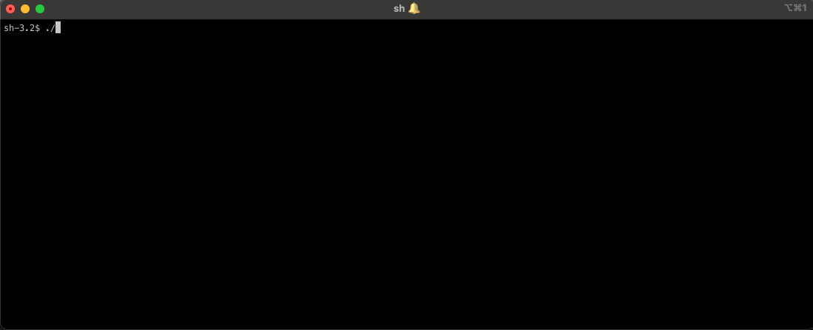

This repository contains a CLI to interact with status pages deployed
on [statuspage.io](statuspage.io) site and enables you to easily set
maintenance windows on multiple pages at once that are deployed across
multiple organizations.



# Usage

For this CLI to work, you need to have API Keys from StatusPage.io.
API keys can be passed to CLI through `-apiKeys` argument:
```sh
❯ ./statuspage.io-maintenance-cli -apiKeys abcd1234,efgh5678
```

Or using `STATUSPAGE_API_KEYS` environment variable:
```sh
❯ STATUSPAGE_API_KEYS=abcd1234,efgh5678 ./statuspage.io-maintenance-cli
```

In case you have multiple StatusPage organizations, you can pass multiple API keys by separating them using comma.

# Installing
